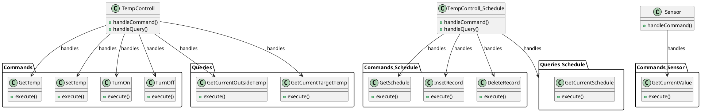

Это шаблон для решения **первой части** проектной работы. Структура этого файла повторяет структуру заданий. Заполняйте его по мере работы над решением.

# Задание 1. Анализ и планирование

Чтобы составить документ с описанием текущей архитектуры приложения, можно часть информации взять из описания компании условия задания. Это нормально.

### 1. Описание функциональности монолитного приложения

**Управление отоплением:**

- Специалисты могут подключать датчики
- Управление отоплением. Пользователи могут удалённо включать/выключать отопление в своих домах.
- Система поддерживает ограниченный набор датчиков температуры и проприетарные устройства для управления отоплением
- …

**Мониторинг температуры:**

- Пользователи могут просматривать текущую температуру в своих домах через веб-интерфейс.
- Система поддерживает собственные датчики
- Мониторинг температуры. Система получает данные о температуре с датчиков, установленных в домах.

### 2. Анализ архитектуры монолитного приложения

[//]: # (Перечислите здесь основные особенности текущего приложения: какой язык программирования используется, какая база данных, как организовано взаимодействие между компонентами и так далее.)

1. **Язык программирования и база данных.** Использование Java и PostgreSQL обеспечивает стабильность и надёжность системы, а также предоставляет широкие возможности для работы с данными. Однако это может усложнить процесс разработки и потребовать дополнительных усилий для обеспечения безопасности и производительности системы.
2. **Архитектура.** Монолитная архитектура имеет свои преимущества и недостатки. С одной стороны, она упрощает разработку и тестирование системы, так как все компоненты находятся в одном месте. С другой стороны, она ограничивает масштабируемость и гибкость системы, так как изменение одного компонента может повлиять на работу других компонентов.
3. **Взаимодействие.** Синхронное взаимодействие между компонентами системы может привести к снижению производительности при увеличении нагрузки. Это может стать проблемой при масштабировании системы и добавлении новых функций.
4. **Масштабируемость.** Ограниченная масштабируемость монолитной архитектуры может затруднить расширение системы для поддержки большого количества пользователей и устройств. Это потребует значительных ресурсов и инвестиций в инфраструктуру.
5. **Развёртывание.** Необходимость остановки всего приложения для развёртывания новых версий может привести к простоям и потере данных. Это может негативно сказаться на репутации компании и удовлетворенности клиентов.

Для решения этих проблем и достижения поставленных целей компании «Тёплый дом» необходимо пересмотреть архитектуру системы и перейти к микросервисной архитектуре. Это позволит разделить систему на независимые компоненты, которые можно разрабатывать, тестировать и развёртывать отдельно. Кроме того, это позволит использовать асинхронное взаимодействие между компонентами, что повысит производительность и масштабируемость системы.


### 3. Определение доменов и границы контекстов

[//]: # (Опишите здесь домены, которые вы выделили.)

Для определения доменов и границ контекстов в экосистеме «Тёплый дом» можно выделить следующие ключевые области:

1. **Управление отоплением.** Этот домен включает функции удалённого управления отопительными системами домов, а также мониторинг температуры через веб-интерфейс. Он тесно связан с технической инфраструктурой, такой как датчики температуры и контроллеры отопления.
2. **Интеграция с умными устройствами.** Домен охватывает взаимодействие с различными умными устройствами, такими как освещение, ворота, системы наблюдения. Это требует разработки API и протоколов для интеграции с устройствами партнёров.
3. **Безопасность и аутентификация.** Домен включает меры по обеспечению безопасности данных пользователей и аутентификации при доступе к системе. Это важно для защиты личной информации и предотвращения несанкционированного доступа.
4. **Техническая поддержка и обслуживание клиентов.** Домен касается обучения специалистов по обслуживанию клиентов работе с новой системой и предоставления качественной поддержки пользователям. Это включает разработку руководств и инструкций, а также организацию обучающих мероприятий.
5. **Сотрудничество с партнёрами.** Домен описывает взаимодействие с другими компаниями и организациями, предоставляющими умные устройства и услуги. Это включает переговоры о партнёрстве, заключение соглашений и совместную работу над проектами. Предоставление партнерского API
6. **Масштабируемость и развёртывание.** Домен относится к расширению системы для поддержки большого количества пользователей и устройств, а также к процессам развёртывания новых версий системы. Это требует планирования инфраструктуры, оптимизации производительности и обеспечения непрерывности работы системы.
7. **Обучение и развитие персонала.** Домен охватывает обучение и профессиональное развитие сотрудников компании, чтобы они могли эффективно выполнять свои обязанности и адаптироваться к изменениям в технологиях и бизнес-процессах. Возможно предоставление демо стендов
8. **Управление домами.** Этот домен охватывает функции, связанные с централизованным управлением домами пользователей. Это может включать управление доступом, освещением, охранными системами и другими аспектами "умного дома" через единый интерфейс.

Границы контекстов определяются на основе взаимодействия между этими доменами. Например, граница между управлением отоплением и интеграцией с умными устройствами проходит там, где система начинает взаимодействовать с внешними устройствами. Граница между безопасностью и аутентификацией и технической поддержкой определяется уровнем доступа и полномочиями пользователей в системе.

### **4. Проблемы монолитного решения**

1. **Сложность масштабирования.** Монолитная архитектура ограничивает возможность масштабировать систему по частям. Это может привести к снижению производительности при увеличении нагрузки и усложнить расширение системы для поддержки большого количества пользователей и устройств.
2. **Трудности развёртывания.** Необходимость остановки всего приложения для развёртывания новых версий может привести к простоям и потере данных. Это негативно скажется на репутации компании и удовлетворённости клиентов.
3. **Ограниченная гибкость.** Внесение изменений в один компонент монолитной системы может повлиять на работу других компонентов. Это затруднит добавление новых функций и интеграцию с умными устройствами партнёров.
4. **Снижение производительности.** Синхронное взаимодействие между компонентами системы может привести к снижению производительности при увеличении нагрузки. Это станет проблемой при масштабировании системы и добавлении новых функций.
5. **Угроза безопасности.** В монолитной системе все компоненты находятся в одном месте, что упрощает злоумышленникам поиск уязвимостей. Если одна часть системы будет скомпрометирована, это может поставить под угрозу всю систему.
6. **Зависимость от разработчиков.** Изменение одного компонента требует глубоких знаний о всей системе, что увеличивает зависимость от конкретных разработчиков. Это замедляет процесс разработки и внедрения новых функций.
7. **Отсутствие модульности.** Монолитную систему сложно разделить на независимые модули, что затрудняет тестирование, отладку и обновление отдельных частей системы.
8. **Проблемы с техническим долгом.** Со временем монолитное приложение накапливает технический долг, который усложняет поддержку и развитие системы. Это потребует дополнительных ресурсов для исправления ошибок и улучшения функциональности.
9. **Затруднения при интеграции.** Интеграция с внешними системами и устройствами может быть сложной из-за монолитной архитектуры. Это усложнит подключение новых умных устройств и расширение функциональности системы.

[//]: # (Если вы считаете, что текущее решение не вызывает проблем, аргументируйте свою позицию.)

### 5. Визуализация контекста системы — диаграмма С4

[//]: # (Добавьте сюда диаграмму контекста в модели C4.)

```puml
@startuml
!include https://raw.githubusercontent.com/plantuml-stdlib/C4-PlantUML/master/C4_Context.puml
LAYOUT_WITH_LEGEND()


Person(admin, "Администратор", "Управляет системой через Web App Admin.")
Person(user, "Пользователь", "Использует систему")

System(control, "Управление отоплением", "Этот домен включает функции удалённого управления отопительными системами домов, а также мониторинг температуры через веб-интерфейс. Он тесно связан с технической инфраструктурой, такой как датчики температуры и контроллеры отопления")
System(broker, "Интеграция с умными устройствами.", "Домен охватывает взаимодействие с различными умными устройствами, такими как освещение, ворота, системы наблюдения. Это требует разработки API и протоколов для интеграции с устройствами партнёров.")
System(auth, "Безопасность и аутентификация.", "Домен включает меры по обеспечению безопасности данных пользователей и аутентификации при доступе к системе. Это важно для защиты личной информации и предотвращения несанкционированного доступа.")
System(support, "Техническая поддержка и обслуживание клиентов.", "Домен касается обучения специалистов по обслуживанию клиентов работе с новой системой и предоставления качественной поддержки пользователям. Это включает разработку руководств и инструкций, а также организацию обучающих мероприятий.")
System_Ext(partners, "Сотрудничество с партнёрами.", "Домен описывает взаимодействие с другими компаниями и организациями, предоставляющими умные устройства и услуги. Это включает переговоры о партнёрстве, заключение соглашений и совместную работу над проектами. Предоставление партнерского API")
System_Ext(scaling, "Масштабируемость и развёртывание.", "Домен относится к расширению системы для поддержки большого количества пользователей и устройств, а также к процессам развёртывания новых версий системы. Это требует планирования инфраструктуры, оптимизации производительности и обеспечения непрерывности работы системы.")
System(personal, "Обучение и развитие персонала.", "Домен охватывает обучение и профессиональное развитие сотрудников компании, чтобы они могли эффективно выполнять свои обязанности и адаптироваться к изменениям в технологиях и бизнес-процессах. Возможно предоставление демо стендов")
System(houseManagement, "Управление домами", "Домен охватывает функции, связанные с централизованным управлением домами пользователей. Это может включать управление доступом, освещением, охранными системами и другими аспектами 'умного дома' через единый интерфейс.")

System(wormHouse, "Тёплый дом", "Монолит")

Rel(admin, wormHouse, "Использует", "")
Rel(user, wormHouse, "Использует", "")

Rel(wormHouse, control, "")
Rel(wormHouse, broker, "")
Rel(wormHouse, auth, "")
Rel(wormHouse, support, "")
Rel(wormHouse, partners, "")
Rel(wormHouse, scaling, "")
Rel(wormHouse, personal, "")
Rel(wormHouse, houseManagement, "")
@enduml
```

[//]: # (Чтобы добавить ссылку в файл Readme.md, нужно использовать синтаксис Markdown. Это делают так:)


```markdown
[//]: # ([Текст ссылки]&#40;URL&#41;)
```

[//]: # (Замените `Текст ссылки` текстом, который хотите использовать для ссылки. Вместо `URL` вставьте адрес, на который должна вести ссылка. Например:)

```markdown
[//]: # ([Посетите Яндекс]&#40;https://ya.ru/&#41;)
```

# Задание 2. Проектирование микросервисной архитектуры

В этом задании вам нужно предоставить только диаграммы в модели C4. Мы не просим вас отдельно описывать получившиеся микросервисы и то, как вы определили взаимодействия между компонентами To-Be системы. Если вы правильно подготовите диаграммы C4, они и так это покажут.

**Диаграмма контейнеров (Containers)**

[//]: # (Добавьте диаграмму.)
```puml
@startuml
top to bottom direction

!includeurl https://raw.githubusercontent.com/RicardoNiepel/C4-PlantUML/master/C4_Component.puml

Person(user, "User", "")
Person(admin, "Administrator", "")

System(wormHouse, "Тёплый дом", "Монолит")

System(api, "Контейнер приложения управления отоплением.", "Этот контейнер содержит код и данные, связанные с управлением отоплением в доме.")
System(db, "Контейнер базы данных.", "Здесь хранятся данные о состоянии системы отопления, включая температуру, расписание работы и т.д.")
System(device, "Контейнеры устройств.", "Эти контейнеры содержат код и данные для управления различными устройствами в доме, такими как термостаты, датчики температуры и т.п.")


Rel(user, wormHouse, "Uses the system")
Rel(admin,wormHouse,"Manages the system")

Rel(wormHouse,api,"")
Rel(wormHouse,db,"")
Rel(wormHouse,device,"")

@enduml
```

**Диаграмма компонентов (Components)**

[//]: # (Добавьте диаграмму для каждого из выделенных микросервисов.)

```puml
@startuml
top to bottom direction

!includeurl https://raw.githubusercontent.com/RicardoNiepel/C4-PlantUML/master/C4_Component.puml

LAYOUT_WITH_LEGEND()

' Диаграмма компонентов для микросервиса "Управление отоплением"
Container_Boundary(control, "Микросервис: Управление отоплением") {
  Component(controller, "HeatingController", "Controller", "Обрабатывает запросы пользователей на управление отоплением.")
  Component(service, "HeatingService", "Service", "Логика управления отоплением, взаимодействие с устройствами.")
  Component(repository, "HeatingRepository", "Repository", "Работа с базой данных для управления устройствами отопления.")
  Component(model, "HeatingModel", "Model", "Модели данных для хранения информации об устройствах отопления.")
  Component(interface, "DeviceAPI", "Interface", "Интерфейс для взаимодействия с физическими устройствами.")
}

Rel(controller, service, "Вызывает", "HTTP/REST")
Rel(service, repository, "Сохраняет/получает данные", "SQL")
Rel(service, interface, "Управляет устройствами", "API")
@enduml
```

```puml
@startuml
top to bottom direction

!includeurl https://raw.githubusercontent.com/RicardoNiepel/C4-PlantUML/master/C4_Component.puml

LAYOUT_WITH_LEGEND()

' Диаграмма компонентов для микросервиса "Интеграция с умными устройствами"
Container_Boundary(broker, "Микросервис: Интеграция с умными устройствами") {
  Component(controller, "DeviceController", "Controller", "Обрабатывает запросы на управление умными устройствами.")
  Component(service, "DeviceService", "Service", "Логика интеграции с устройствами.")
  Component(repository, "DeviceRepository", "Repository", "Хранение данных об интеграциях и устройствах.")
  Component(model, "DeviceModel", "Model", "Модели данных для описания подключённых устройств.")
  Component(interface, "PartnerDeviceAPI", "Interface", "Интерфейс для интеграции с API партнёров.")
}

Rel(controller, service, "Вызывает", "HTTP/REST")
Rel(service, repository, "Сохраняет/получает данные", "SQL")
Rel(service, interface, "Взаимодействует с партнёрами", "API")

@enduml
```

```puml
@startuml
top to bottom direction

!includeurl https://raw.githubusercontent.com/RicardoNiepel/C4-PlantUML/master/C4_Component.puml

LAYOUT_WITH_LEGEND()

' Диаграмма компонентов для микросервиса "Безопасность и аутентификация"
Container_Boundary(auth, "Микросервис: Безопасность и аутентификация") {
  Component(controller, "AuthController", "Controller", "Обрабатывает запросы на авторизацию и аутентификацию.")
  Component(service, "AuthService", "Service", "Логика проверки учётных данных.")
  Component(repository, "UserRepository", "Repository", "Работа с базой данных пользователей.")
  Component(model, "UserModel", "Model", "Модели данных для хранения информации о пользователях.")
  Component(interface, "TokenProvider", "Interface", "Генерация и проверка токенов доступа.")
}

Rel(controller, service, "Вызывает", "HTTP/REST")
Rel(service, repository, "Сохраняет/получает данные", "SQL")
Rel(service, interface, "Работает с токенами", "JWT")

@enduml
```

```puml
@startuml
top to bottom direction

!includeurl https://raw.githubusercontent.com/RicardoNiepel/C4-PlantUML/master/C4_Component.puml

LAYOUT_WITH_LEGEND()

' Диаграмма компонентов для микросервиса "Техническая поддержка и обслуживание клиентов"
Container_Boundary(support, "Микросервис: Техническая поддержка") {
  Component(controller, "SupportController", "Controller", "Обрабатывает запросы от пользователей для поддержки.")
  Component(service, "SupportService", "Service", "Логика поддержки пользователей.")
  Component(repository, "SupportRepository", "Repository", "Хранение данных об обращениях в поддержку.")
  Component(model, "SupportModel", "Model", "Модели данных для хранения обращений и их статусов.")
}

Rel(controller, service, "Вызывает", "HTTP/REST")
Rel(service, repository, "Сохраняет/получает данные", "SQL")

@enduml
```

```puml
@startuml
top to bottom direction

!includeurl https://raw.githubusercontent.com/RicardoNiepel/C4-PlantUML/master/C4_Component.puml

LAYOUT_WITH_LEGEND()

' Диаграмма компонентов для микросервиса "Сотрудничество с партнёрами"
Container_Boundary(partners, "Микросервис: Сотрудничество с партнёрами") {
  Component(controller, "PartnerController", "Controller", "Обрабатывает запросы для работы с партнёрскими API.")
  Component(service, "PartnerService", "Service", "Логика взаимодействия с партнёрами.")
  Component(repository, "PartnerRepository", "Repository", "Хранение данных о партнёрах и соглашениях.")
  Component(model, "PartnerModel", "Model", "Модели данных для описания партнёрских соглашений.")
}

Rel(controller, service, "Вызывает", "HTTP/REST")
Rel(service, repository, "Сохраняет/получает данные", "SQL")

@enduml
```

```puml
@startuml
top to bottom direction

!includeurl https://raw.githubusercontent.com/RicardoNiepel/C4-PlantUML/master/C4_Component.puml

LAYOUT_WITH_LEGEND()

' Диаграмма компонентов для микросервиса "Масштабируемость и развёртывание"
Container_Boundary(scaling, "Микросервис: Масштабируемость и развёртывание") {
  Component(controller, "ScalingController", "Controller", "Обрабатывает запросы на масштабирование системы.")
  Component(service, "ScalingService", "Service", "Логика развёртывания и масштабирования.")
  Component(repository, "ScalingRepository", "Repository", "Хранение данных о конфигурации развёртывания.")
  Component(model, "ScalingModel", "Model", "Модели данных для управления конфигурацией системы.")
}

Rel(controller, service, "Вызывает", "HTTP/REST")
Rel(service, repository, "Сохраняет/получает данные", "SQL")


@enduml
```

```puml
@startuml
top to bottom direction

!includeurl https://raw.githubusercontent.com/RicardoNiepel/C4-PlantUML/master/C4_Component.puml

LAYOUT_WITH_LEGEND()

' Диаграмма компонентов для микросервиса "Обучение и развитие персонала"
Container_Boundary(personal, "Микросервис: Обучение и развитие персонала") {
  Component(controller, "TrainingController", "Controller", "Обрабатывает запросы на обучение и развитие.")
  Component(service, "TrainingService", "Service", "Логика управления обучением сотрудников.")
  Component(repository, "TrainingRepository", "Repository", "Хранение данных об обучающих программах.")
  Component(model, "TrainingModel", "Model", "Модели данных для описания программ обучения.")
}

Rel(controller, service, "Вызывает", "HTTP/REST")
Rel(service, repository, "Сохраняет/получает данные", "SQL")


@enduml
```

**Диаграмма кода (Code)**

[//]: # (Добавьте одну диаграмму или несколько.)



# Задание 3. Разработка ER-диаграммы

[//]: # (Добавьте сюда ER-диаграмму. Она должна отражать ключевые сущности системы, их атрибуты и тип связей между ними.)

```puml
@startuml

skinparam packageStyle rectangle

entity "Пользователи" as Users {
  attributes:
    UserID : Integer
    UserName : String
    Password : String
    Email : String
}

entity "Устройства" as Devices {
  attributes:
    DeviceID : Integer
    Model : String
    Status : String
    Temperature : Float
    LastUpdated : DateTime
}

entity "Модули управления" as ControlModules {
  attributes:
    ModuleID : Integer
    ModuleName : String
    Description : String
}

entity "Комплекты устройств" as DeviceBundles {
  attributes:
    BundleID : Integer
    BundleName : String
    Price : Float
}

entity "Настройки" as Settings {
  attributes:
    SettingID : Integer
    SettingKey : String
    SettingValue : String
}

entity "События" as Events {
  attributes:
    EventID : Integer
    EventDate : Date
    EventType : String
    RelatedDeviceID : Integer
}

entity "Сценарии" as Scenarios {
  attributes:
    ScenarioID : Integer
    ScenarioName : String
    ScenarioDescription : String
}

entity "Отчёты" as Reports {
  attributes:
    ReportID : Integer
    ReportName : String
    ReportingPeriod : Period
}

Users -> Devices : "Управляет" : UserID = OwnerID
ControlModules -> Devices : "Связан" : ModuleID
DeviceBundles -> Devices : "Содержит" : BundleID
Settings -> ControlModules : "Применяется" : SettingID
Events -> ControlModules : "Генерируется" : RelatedDeviceID
Events -> Devices : "Генерируется" : DeviceID
Scenarios -> Events : "Включает" : EventID
Reports -> Scenarios : "Сгенерирован" : ScenarioID

@enduml
```


